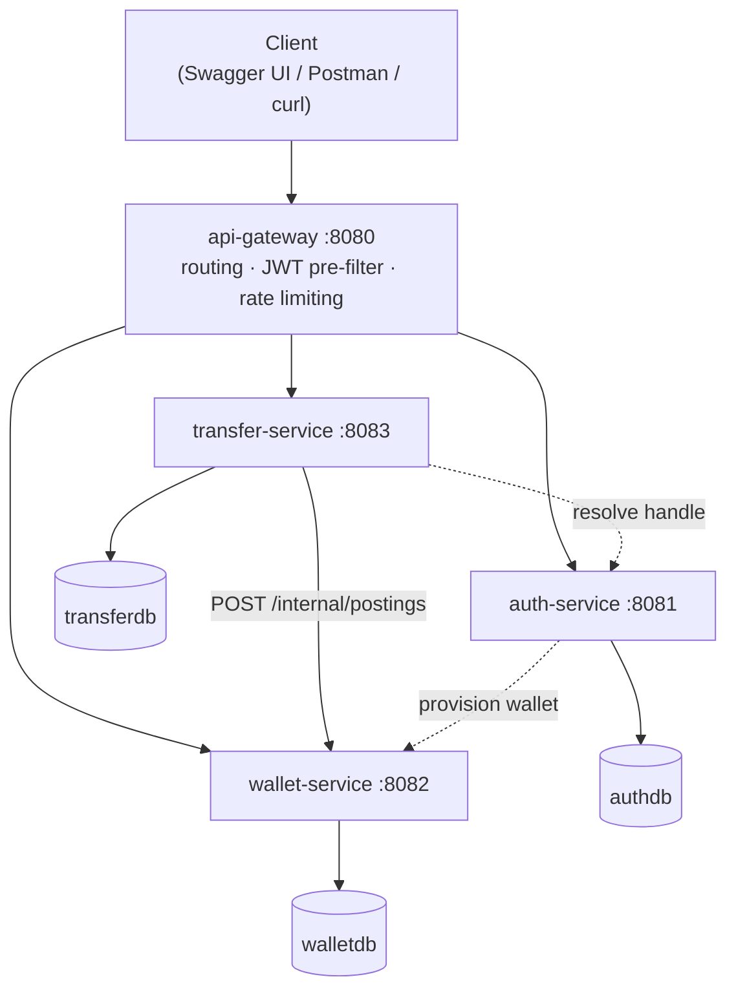

# Digital Wallet

[](https://github.com/Moulishwar/Digital-Wallet/actions/workflows/ci.yml)

A peer-to-peer digital wallet built as four independent Spring Boot services on a **double-entry
ledger**. Users register, top up, send money to each other by handle, and pull a paginated statement
of everything that has ever happened to their money.

The point of the project is not the feature list — it is how the money is modelled. **Balances are
never edited in place.** Every movement of value writes a balanced pair of ledger rows, the way real
financial systems do, and every balance in the system is provably derivable from that history.

---

## Architecture



| Service | Port | Database | Owns |
|---|---|---|---|
| `api-gateway` | 8080 | — | The only public entry point. Routes, CORS, rate limiting, and rejecting bad tokens early. |
| `auth-service` | 8081 | `authdb` | Users, credentials, roles, JWT signing, refresh-token rotation, JWKS. |
| `wallet-service` | 8082 | `walletdb` | Accounts, the ledger, balances, statements. **Sole owner of money truth.** |
| `transfer-service` | 8083 | `transferdb` | Transfer intent, idempotency, lifecycle, reconciliation. |

Each service owns its own PostgreSQL instance — separate servers, not separate schemas. Sharing a
server would make a cross-service join trivially easy to write, which is exactly the coupling the
boundaries exist to prevent.

### Why transfer and wallet are separate

This is the boundary most worth defending, because splitting them looks like it creates a
distributed transaction. It does not.

- **`transfer-service` owns the intent.** "User A wants to send ₹500 to user B, request key
  `abc-123`" — a workflow with a lifecycle and retry semantics.
- **`wallet-service` owns the effect.** Both ledger lines live in one database, so posting is a
  **single local ACID transaction**. No two-phase commit, no saga for the money itself.

That leaves exactly one distributed problem: *did my call succeed before the network died?* It is
answered by making the posting idempotent on the transfer id and running a reconciliation sweep —
a real distributed-systems problem with a simple, honest answer.

---

## Running it

**Prerequisites:** JDK 21, Docker Desktop. Maven comes with the repository via `mvnw`.

```bash
cp .env.example .env
```

You need to generate two secrets. Neither has a fallback: a missing value fails startup loudly
rather than quietly running on something insecure.

```bash
# The RSA keypair auth-service signs tokens with
KEYS=$(mktemp -d)
openssl genpkey -algorithm RSA -pkeyopt rsa_keygen_bits:2048 -outform DER -out "$KEYS/priv.der"
openssl pkcs8 -topk8 -nocrypt -inform DER -in "$KEYS/priv.der" -outform DER -out "$KEYS/priv_pkcs8.der"
openssl rsa -in "$KEYS/priv.der" -inform DER -pubout -outform DER -out "$KEYS/pub.der"
base64 -w0 "$KEYS/priv_pkcs8.der"   # -> JWT_PRIVATE_KEY
base64 -w0 "$KEYS/pub.der"          # -> JWT_PUBLIC_KEY
rm -rf "$KEYS"

# The service-to-service credential
openssl rand -base64 32     # -> SERVICE_CREDENTIAL
```

### The whole system

```bash
./mvnw -DskipTests install -pl platform-common -am
./mvnw -DskipTests spring-boot:build-image -pl auth-service,wallet-service,transfer-service,api-gateway
docker compose --profile services up -d
```

The first line installs the shared library the services depend on. The image build names the four
services because `platform-common` is a library, not an application, so it gets no image.

Everything is then behind `http://localhost:8080`. Only the gateway publishes a port; the three
services are reachable from each other and from nowhere else, which is what makes `/internal/**`
genuinely internal. Images are built by Cloud Native Buildpacks, so there is no Dockerfile in this
repository to drift out of step with the build.

### The development loop

```bash
docker compose up -d                    # databases only
./mvnw -pl wallet-service spring-boot:run
```

Run the services yourself when you want a debugger attached.

### Tests

```bash
./mvnw verify                # 123 tests: 35 unit, 88 integration against real PostgreSQL
./mvnw -Psecurity-scan verify   # + OWASP dependency-check (slow on first run)
```

Docker must be running: the integration tests use Testcontainers, not H2. See
[Troubleshooting](#troubleshooting) if Testcontainers cannot find your daemon.

### Troubleshooting

- **`permission denied while trying to connect to the docker API`** (Linux): your user is not in
  the `docker` group. Run `sudo usermod -aG docker $USER`, then log out and back in.
- **`Could not find a valid Docker environment`**: the Docker daemon is not running, or
  Testcontainers is looking for the wrong socket. Start Docker; with Colima or Rancher Desktop,
  set `DOCKER_HOST` to the socket they expose.

---

## Trying it out

Swagger UI is served per service — `http://localhost:8081/swagger-ui.html` and so on. There is also
a Postman collection at [`postman/digital-wallet.postman_collection.json`](postman/) that walks the
whole flow and captures the token automatically.

By hand:

```bash
# Register two users (each gets a wallet)
curl -X POST localhost:8080/api/auth/register -H 'Content-Type: application/json' \
  -d '{"handle":"alice","email":"alice@example.com","password":"Correct-Horse-9","fullName":"Alice"}'
curl -X POST localhost:8080/api/auth/register -H 'Content-Type: application/json' \
  -d '{"handle":"bob","email":"bob@example.com","password":"Correct-Horse-9","fullName":"Bob"}'

# Log in
TOKEN=$(curl -s -X POST localhost:8080/api/auth/login -H 'Content-Type: application/json' \
  -d '{"email":"alice@example.com","password":"Correct-Horse-9"}' | jq -r .accessToken)

# Top up 1000.00, then send 50.00 to bob
curl -X POST localhost:8080/api/wallets/me/topups -H "Authorization: Bearer $TOKEN" \
  -H 'Idempotency-Key: topup-1' -H 'Content-Type: application/json' -d '{"amountMinor":100000}'

curl -X POST localhost:8080/api/transfers -H "Authorization: Bearer $TOKEN" \
  -H 'Idempotency-Key: transfer-1' -H 'Content-Type: application/json' \
  -d '{"recipientHandle":"bob","amountMinor":5000,"note":"Dinner"}'

# Send the same request again — same key, same answer, no second payment
curl -X POST localhost:8080/api/transfers -H "Authorization: Bearer $TOKEN" \
  -H 'Idempotency-Key: transfer-1' -H 'Content-Type: application/json' \
  -d '{"recipientHandle":"bob","amountMinor":5000,"note":"Dinner"}'

curl localhost:8080/api/wallets/me/statement -H "Authorization: Bearer $TOKEN"
```

---

## The double-entry ledger

Every movement of value creates one **journal entry** holding two or more **ledger lines** whose
signed amounts **sum to exactly zero**. Credit is positive, debit is negative.

Alice sends Bob ₹500:

| Journal entry | Account | Amount (paise) |
|---|---|---|
| line 1 | `alice_wallet` | `-50000` |
| line 2 | `bob_wallet` | `+50000` |
| | **sum** | **`0`** |

Money cannot appear from nowhere, so a top-up debits `SYSTEM_FUNDING` — an internal account
standing for the bank rail outside the platform. It runs a large negative balance, and that is
correct: its magnitude is exactly how much value has entered the system.

**Ledger lines are append-only.** No `UPDATE`, no `DELETE`, ever — enforced in three places: no
setters and `@Immutable` on the entity, no mutating repository method, and a database trigger that
raises on either operation. A mistaken transfer is corrected by posting a **reversing entry**, which
is how real ledgers work. Even the test suite has to disable that trigger to reset between tests,
which is the protection proving itself.

**Balance is derived truth, cached for speed.** The authoritative balance is
`SUM(ledger_line.amount_minor)`. Summing all history on every read does not scale, so
`account.balance_minor` is maintained as a cache inside the same transaction as the posting — and
`GET /api/admin/reconciliation` asserts, live, that the two still agree for every account.

**Money is never a floating-point number.** Everything is `BIGINT` minor units: `12345` means
₹123.45. No `double` or `float` anywhere. `BigDecimal` appears only at the API boundary for
formatting, and a small `Money` value type means a bare `long` cannot be passed where an amount is
expected.

---

## The problems this is built to survive

**Two people spending the same money at once.** Both requests read the same balance, both approve,
the wallet goes negative. The fix is that the account rows are locked before the check, and the
check and the debit happen in the same transaction — the classic TOCTOU overdraft bug, closed.
Proven by a test that fires 50 concurrent ₹10 transfers at a ₹100 balance and asserts exactly 10
succeed and the wallet lands on exactly ₹0.

**Deadlock.** Alice pays Bob while Bob pays Alice; each locks its own sender first; both wait
forever. Rows are locked in a fixed id order instead, so one simply waits. Two lines of code for a
class of bug that is genuinely nasty in production — and there is a test firing both directions at
once.

**Retrying after a timeout.** Every transfer carries an `Idempotency-Key`, scoped per user by a
unique constraint. Concurrent duplicates race at the database rather than in a read-then-write
window, and the losers adopt the winner's answer. Twenty concurrent requests with one key produce
one transfer and twenty identical responses. Failures are replayed too — the key records what the
request answered, not just whether it succeeded.

**"Did that actually happen?"** When wallet-service does not answer, transfer-service does not
guess. The transfer is marked `NEEDS_RECONCILIATION`, the client gets `202 Accepted` with an id to
poll, and a scheduled sweep asks wallet-service whether a posting with that transfer's id exists.
Because that reference is unique in the ledger the answer is unambiguous: found means done, not
found means safe to retry.

Only errors that are *understood* to mean "this will never succeed" fail a transfer. An
unrecognised 4xx — a stale route, a proxy answering for an absent service — is treated as an unknown
outcome instead. Failing is terminal, and doing it on a misunderstanding would tell a sender their
payment was refused when it was never even seen.

---

## Security

- **RS256 JWTs**, 15-minute access tokens. auth-service holds the private key; every other service
  verifies with the public key from its JWKS endpoint. **No shared secret is distributed** — a
  compromised wallet-service still cannot mint a token.
- **Refresh-token rotation with reuse detection.** Tokens are stored hashed (SHA-256), never raw.
  Presenting an already-used token indicates theft, and the whole chain is revoked.
- **Issuer is verified, not just the signature.** A signature only proves the token was signed by
  some key in the key set, not that it was minted for this system.
- **Ownership is always checked against the token subject**, never a request parameter. There is no
  user-supplied `userId` anywhere in the public API — the commonest real-world API vulnerability
  (IDOR) is designed out rather than guarded against. Asking for someone else's transfer returns
  404, not 403, because 403 would confirm the id exists.
- **`/internal/**` is doubly protected**: the gateway has no route to it *and* it requires a service
  credential compared in constant time. Network position alone guards nothing once something
  hostile is inside the perimeter. The authority granted is `ROLE_SERVICE` — a perfectly valid user
  token gets 403, because being a legitimate user is not authority to post into the ledger.
- **Secrets have no defaults.** A missing value fails startup rather than falling back to something
  guessable.
- **Errors never leak existence.** Login returns one message for both "no such user" and "wrong
  password".
- All failures are RFC 7807 Problem Details with a trace id, in the same shape from every service —
  including the gateway, which reproduces it rather than importing the servlet-based handler.

---

## Testing

| Layer | Tool | Covers |
|---|---|---|
| Unit | JUnit 5 | `Money` arithmetic, journal-entry balancing, transfer state machine, request hashing |
| Integration | Testcontainers, real PostgreSQL 16 | Repositories, Flyway migrations, transaction boundaries, the immutability trigger |
| Inter-service | WireMock | transfer-service against a stubbed wallet-service, including 5xx and genuine socket timeouts |
| Concurrency | JUnit + `ExecutorService` | The overdraft, deadlock and idempotency tests below |

Not H2. This ledger depends on behaviour an in-memory database either fakes or lacks outright —
`SELECT ... FOR UPDATE` semantics, partial unique indexes, and the PL/pgSQL trigger that makes lines
append-only. A suite that passes on H2 and then meets PostgreSQL in production has proven very
little.

**The four tests that matter most:**

- **Overdraft** — 50 concurrent ₹10 transfers against ₹100. Exactly 10 succeed, the balance lands on
  exactly ₹0, never negative.
- **Zero-sum** — the signed total of every line in the system is 0. Money is moved, never created.
- **Reconciliation** — every cached balance equals the sum of its own ledger lines.
- **Idempotency** — one key, twenty concurrent requests, one transfer, twenty identical responses.

---

## The ledger in Oracle

[`db/oracle/`](db/oracle/) holds the wallet-service ledger model rewritten in Oracle SQL. The
services do not use it. They run only on PostgreSQL. It exists so the data model can be read and
queried in Oracle as well. Run the scripts in order:

| Script | Contents |
|---|---|
| `01_schema.sql` | The ledger tables, rewritten for Oracle. The header explains each type change: `UUID` → `RAW(16)`, `BIGINT` → `NUMBER(19)`, and a partial index → a function-based unique index. |
| `02_seed.sql` | Fixed sample data with no randomness: 20 users, one wallet each, and 300 transfers spread over about seven months. |
| `03_reports.sql` | Six analytical queries, each with its expected result for that seed data: monthly volume with a running total, running balances rebuilt from the lines, top senders and recipients, reconciliation, the zero-sum audit, and a daily rollup kept up to date with `MERGE`. |

---

## Stack

Java 21 · Spring Boot 4.0 · Spring Cloud Gateway · Spring Security 7 (OAuth2 Resource Server) ·
Spring Data JPA / Hibernate 7 · PostgreSQL 16 · Flyway · springdoc-openapi · JUnit 5 · Testcontainers ·
WireMock · Maven (multi-module) · Docker Compose · GitHub Actions · Oracle SQL (reference schema
and reports)
